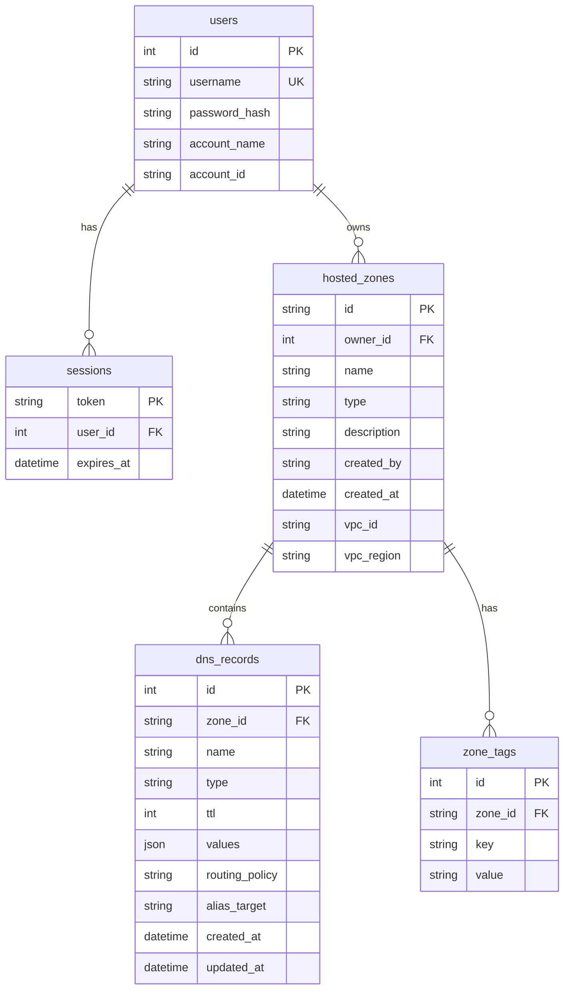

# Route 53 Clone

A functional clone of the AWS Route 53 console: accounts with sign-up and sign-in, hosted zones, DNS records, persistent SQLite storage and a FastAPI backend. It reproduces the console's look and workflows; it does **not** perform real DNS.

## Live demo

**https://route53-clone-zeta.vercel.app/**

| | |
|---|---|
| Username | `admin` |
| Password | `admin123` |

You can also create your own account on the **Create a new AWS account** page; each account only sees its own hosted zones.

> The backend runs on a free hosting tier. If the site has been idle, the first request can take 30 to 60 seconds while the server wakes up. Data created in the demo may be reset when the server restarts; the `admin` account and sample data are re-seeded automatically.

## Tech stack

| Layer | Tech |
|---|---|
| Frontend | Next.js 14 (App Router, TypeScript) + [Cloudscape Design System](https://cloudscape.design), the design system the AWS console is built with |
| Backend | FastAPI, SQLAlchemy 2, Pydantic 2 |
| Database | SQLite |
| Hosting | Vercel (frontend), Render (backend) |

## Features

- **Accounts:** sign up (user name, password, optional account alias; a 12-digit account ID is generated), sign in, sign out, 7-day sessions in an httpOnly cookie that survive reloads. An expired session sends the user back to the sign-in page.
- **Hosted zones:** list with a multi-token property filter (and/or), pagination and empty state; create public or private zones (private zones need a VPC ID and Region), with description and tags; edit the description; delete with type-to-confirm and the `HostedZoneNotEmpty` rule; details page with name servers, VPC and tags.
- **Records:** table with property filter, Type / Routing policy / Alias filters, pagination, column and page-size preferences, multi-select; Create record with *Add another record* (atomic batch, errors point at the offending record); Edit record side pane; delete modal (single or bulk); Alias records; all nine types (A, AAAA, CNAME, TXT, MX, NS, PTR, SRV, CAA) with per-type validation; *Test record*.
- **Route 53 chrome:** top bar with a working search box, side navigation, breadcrumbs, flashbar notifications, help panel, footer. Dashboard, Health checks, Profiles, Traffic policies, Registered domains and Resolver pages are "Coming soon".
- **Bonus:** import BIND zone files, export JSON / BIND, dark mode, keyboard shortcuts (`?` lists them), bulk delete.

## Run locally

```bash
# 1. API (http://localhost:8000, interactive docs at /docs)
cd backend
pip install -r requirements.txt
uvicorn app.main:app --port 8000     # creates route53.db and seeds the demo account on first start

# 2. Web (http://localhost:3000)
cd frontend
npm install
npm run dev
```

Or run both with Docker:

```bash
docker compose up --build
```

Checks: `cd backend && pytest` (API tests) and `cd frontend && npm run typecheck && npm run build`.

### Environment variables

| Variable | Where | Purpose |
|---|---|---|
| `API_URL` | Frontend (build time) | Backend URL the `/api/*` rewrite points to. Default `http://localhost:8000` |
| `DATABASE_URL` | Backend | Default `sqlite:///./route53.db` |
| `CORS_ORIGINS` | Backend | Comma-separated allowed origins |
| `COOKIE_SECURE` | Backend | Set to `1` on HTTPS deployments |

## Deploy for free

The frontend and backend are deployed separately. Deploy the **backend first**, because the frontend needs its URL at build time.

### 1. Backend on Render

1. Sign up at [render.com](https://render.com) with GitHub.
2. **New**, then **Web Service**, and select this repository.
3. Settings:
   - Runtime: **Docker**
   - Branch: `main`
   - Root Directory: `backend`
   - Instance Type: **Free**
4. Advanced:
   - Environment variable `COOKIE_SECURE` = `1`
   - Health Check Path: `/api/health`
5. Deploy, then open `https://<your-service>.onrender.com/api/health`. It should return `{"status":"ok"}`.

### 2. Frontend on Vercel

1. Sign up at [vercel.com](https://vercel.com) with GitHub.
2. **Add New**, then **Project**, and import this repository.
3. Settings:
   - Root Directory: `frontend`
   - Environment variable `API_URL` = `https://<your-service>.onrender.com` (no trailing slash)
4. Deploy.

`API_URL` is baked in at build time. If you change it, redeploy the frontend.

### Notes on free hosting

- Render's free instance sleeps after about 15 minutes of inactivity.
- Render's free disk is ephemeral: the database resets on restart and the demo account is re-seeded. For persistence, add a disk on a paid plan or point `DATABASE_URL` at a hosted Postgres database.

## Architecture

```
frontend/  Next.js. /api/* is rewritten to FastAPI, so the session cookie is same-origin (no CORS or cookie issues).
  app/login, app/signup           public pages
  app/route53/v2/...              home, getstarted, hostedzones (list, create, [id], [id]/create-record, [id]/import), placeholders
  components/                     Shell, RecordsTab, RecordForm, EditRecordPanel, TagsTab, ZoneModals, TestRecordModal, providers
  lib/                            api.ts (typed client), filters.ts (filter tokens -> API params), copy.ts, theme.ts
backend/   FastAPI. router -> service -> SQLAlchemy model; business rules live in services.
  app/routers/                    auth, zones, records, export
  app/services/                   zone_service, record_service, validators, filters, zone_file (BIND parser)
  tests/                          pytest
```

Errors share one shape, `{"error": {"code", "message", "field", "index"}}`: `field` is the form field to highlight and `index` is the item of a batch request that failed.

## Database schema



Constraints: unique (`hosted_zones.owner_id`, `name`, `type`); unique (`dns_records.zone_id`, `name`, `type`); `ON DELETE CASCADE` from users to zones and from zones to records and tags. Record names are lowercase FQDNs without a trailing dot. Passwords are stored as salted PBKDF2-SHA256 hashes. Another account's zone ID answers 404, exactly like a missing one.

## API overview

All routes except sign-up, sign-in and health require the session cookie.

| Method | Path | Notes |
|---|---|---|
| POST | `/api/auth/signup` | `username`, `password`, `account_name?`; signs the new user in. 409 if the name is taken |
| POST | `/api/auth/login`, `/api/auth/logout` | login takes an optional `account` (ID or alias) that must match |
| GET | `/api/auth/me` | |
| GET | `/api/hosted-zones` | `f` (repeatable `property:text`), `op` (`and`/`or`), `page`, `page_size` |
| POST | `/api/hosted-zones` | creates NS + SOA automatically; private zones need `vpc_id` and `vpc_region` |
| GET / PATCH / DELETE | `/api/hosted-zones/{id}` | PATCH edits the description; DELETE fails if other records exist |
| GET / PUT | `/api/hosted-zones/{id}/tags` | keys must be unique and can't start with `aws:` |
| GET | `/api/hosted-zones/{id}/records` | filters, `type`, `routing_policy`, `alias`, pagination |
| POST | `/api/hosted-zones/{id}/records` | one record or a list (atomic) |
| PUT / DELETE | `/api/hosted-zones/{id}/records/{rid}` | NS/SOA: TTL only, never deletable |
| POST | `/api/hosted-zones/{id}/records/bulk-delete` | `{ids: []}` |
| POST | `/api/hosted-zones/{id}/records/import` | `{zone_file}` BIND text, atomic |
| GET | `/api/hosted-zones/{id}/records/test` | `name`, `type` (answers from stored data) |
| GET | `/api/hosted-zones/{id}/export` | `format=json\|bind` |

Interactive API docs are served at `/docs` on the backend.

## Validation rules

User names: 3 to 64 characters from letters, numbers and `+ = , . @ _ -`; passwords 8 to 128 characters. Record names must end with the zone name (blank = apex); CNAME can't sit at the apex or share a name with other types; A/AAAA must be valid IPs; MX `priority host`; SRV `priority weight port host`; CAA `flags tag "value"`; TXT is auto-quoted; TTL 0 to 2147483647 (default 300); NS/SOA can't be created or deleted; TLD zones (e.g. `com`) are rejected. Imported records must lie inside the zone.

## Known deviations

- Logo and tile illustrations are SVG recreations, not official AWS assets (swap `frontend/public/*.svg`).
- Only Simple routing is functional; other policies are listed but disabled. DNSSEC and query logging are informational stubs.
- The top-bar search covers hosted zones only; CloudShell, notifications, support and the account menu entries other than Sign out are decorative.
- On hosts with an ephemeral disk the database resets on restart and the demo account is re-seeded.

## Disclaimer

This is an educational project. It is not affiliated with or endorsed by Amazon Web Services. AWS and Route 53 are trademarks of Amazon.com, Inc.
